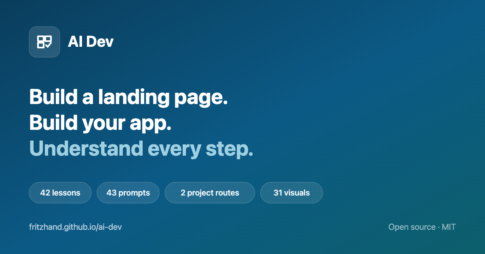

<div align="center">

<a href="https://fritzhand.github.io/ai-dev/"></a>

# AI Dev

**Build a landing page. Build your app. Understand every step.**

A project-first course for learning how to plan, build, check, and ship with AI.
Work through it by yourself or teach it to a room.

> Every company, customer, metric, and project used as an example in this
> course is invented. Nothing here is drawn from any real client engagement.

[**Start here**](lessons/00-start-here.md) ·
[**Build a landing page**](lessons/04-project-landing-page/INDEX.md) ·
[**Build your app**](lessons/05-project-app/INDEX.md) ·
[**Teach the workshop**](instructor/README.md) ·
[**Course map**](lessons/INDEX.md) ·
[**Prompt library**](https://fritzhand.github.io/ai-dev/prompts/) ·
[**Infographics**](reference/infographics.md) ·
[**Read it as a site**](https://fritzhand.github.io/ai-dev/)

[](https://fritzhand.github.io/ai-dev/)


<br>

**2** project routes · **42** lessons · **43** reusable prompts ·
**12** copyable project templates · **31** reviewed infographics ·
**81** generated site pages

</div>

---

## What this repo is

AI Dev is a curriculum, not a starter application and not a wall of theory.
The projects are the spine:

1. Build and deploy a sourced landing page with Astro, GitHub, and Vercel.
2. Turn your own app idea into one authenticated, tested, deployed vertical
   slice using a pinned Next.js baseline, Supabase, and Google sign-in.

The short lessons on models, context, the terminal, Git, APIs, databases,
secrets, and evaluation exist to unblock those projects at the moment a learner
needs them. You do not need to read the course from top to bottom before making
something.

The same material supports two modes:

- **Self-serve:** a learner follows a project route, opens reference lessons as
  needed, and records evidence at each gate.
- **Instructor-led:** a facilitator runs the fixed 120-minute landing-page
  workshop or teaches learner-chosen apps through milestones.

There is deliberately **no canonical teaching app**. The course supplies the
sequence, templates, safety boundaries, and review method. The learner supplies
the user, problem, data, product decisions, and definition of done.

## The problem this solves

“Build it with AI” often hides the parts a beginner most needs to see:

- what files and accounts must exist before work starts;
- which choices belong to the human;
- what the AI can read or change;
- what a command, migration, permission, or deployment will do;
- how to split one large idea into recoverable milestones;
- how to know whether the result actually works;
- where secrets, source material, and user data may safely live.

AI Dev makes those steps explicit. Every practical lesson starts with the
ground it requires, stops when that ground is missing, puts consequential
actions behind a human approval gate, and ends with evidence plus a save point.

The working loop is:

```text
approved source → written brief or PRD → plan → human review
→ one bounded milestone → checks and browser evidence → commit
→ next milestone or stop
```

The AI may inspect, propose, draft, edit, run, and report. The learner still
owns scope, factual claims, architecture, permissions, data, tests, cost,
release, and rollback.

## The two project routes

| Route | Starts with | Shared sequence | Finish line | Teaching format |
| --- | --- | --- | --- | --- |
| [Landing page](lessons/04-project-landing-page/INDEX.md) | Approved source material, assets, and a brief | Knowledge base → `design.md` → reviewed plan → Astro milestones → browser review → GitHub → Vercel | Reviewed commit and working production URL | Self-serve or a strict [120-minute workshop](instructor/landing-page-120-minutes.md) |
| [Your app](lessons/05-project-app/INDEX.md) | The learner's own PRD and the pinned starter baseline | PRD → baseline → system map → data → auth → vertical slice → differentiator → evaluation → release | One learner-chosen workflow meeting its approved PRD in production | Self-serve or milestone-led; no fixed duration |

### Landing-page route

The landing-page project is intentionally constrained. It teaches a complete
source-to-production loop without requiring a database or authentication:

```text
source inventory
→ project brief
→ knowledge-base.md
→ design.md
→ implementation plan
→ Astro build
→ local browser checks
→ reviewed GitHub commit
→ Vercel deployment
```

Custom domains, forms, analytics, and search are follow-up layers. They are not
allowed to consume the two-hour core workshop.

### App route

The app project starts only after the learner writes and approves a PRD. It
uses [`KRSHH/standard-saas-starter`](https://github.com/KRSHH/standard-saas-starter)
at audited
[commit `e887b0c`](https://github.com/KRSHH/standard-saas-starter/commit/e887b0cc9d380576aa3318bf8c095afbc3d768cb),
then strips, keeps, or defers starter systems according to that PRD.

```text
learner idea
→ PRD
→ pinned and passing baseline
→ keep / change / remove / defer map
→ Supabase connection
→ reviewed data model and migration
→ Google sign-in
→ protected vertical slice
→ product differentiator
→ repeatable evaluation
→ production verification
```

The course never silently invents the learner's customer, feature set, schema,
or differentiator.

## Course map

Parts 4 and 5 are the project spines. Parts 1–3 and 6 are references that the
projects route into.

| Part | What it covers | Use it when |
| ---: | --- | --- |
| [1. What AI is](lessons/01-what-ai-is/INDEX.md) | Models, training, weights, model choice, context, cost, prompting, retrieval, and fine-tuning | A project decision depends on what the model can or cannot do |
| [2. Where you use it](lessons/02-where-you-use-it/INDEX.md) | Chat, agentic workspaces, connectors, permissions, APIs, keys, and billing | A task moves from conversation into files, tools, or an external service |
| [3. The machine](lessons/03-the-machine/INDEX.md) | Terminal, editor, Node, packages, Git, GitHub, Markdown, assets, hosting, and databases | A command or layer is unfamiliar |
| [4. Project: a landing page](lessons/04-project-landing-page/INDEX.md) | Source material through Astro and Vercel | You want the shorter complete build-and-ship route |
| [5. Project: an app](lessons/05-project-app/INDEX.md) | PRD through data, auth, one complete workflow, and production | You are building from your own product idea |
| [6. Doing it well](lessons/06-doing-it-well/INDEX.md) | Approval gates, secrets, context engineering, evals, cost, rollback, and maintenance | The work can affect money, data, accounts, other people, or production |

## Quickstart for a learner

### 1. Choose the route

Open [Start here](lessons/00-start-here.md). Write down:

- the project you are building;
- who owns its content, repository, accounts, data, and deployment;
- the finish line for this session;
- what must not change;
- the evidence that will count as done.

Do not start by asking an AI to “build the whole thing.”

### 2. Check the ground

Use the setup route for your computer:

- [macOS setup](reference/setup-macos.md)
- [Windows setup](reference/setup-windows.md)
- [troubleshooting](reference/troubleshooting.md)

The landing-page route needs the project-declared Node/npm setup, Git, GitHub,
Vercel, and approved source material.

The app route also follows the pinned starter's declared runtime and package
manager, and later requires an authorized development Supabase project and
Google OAuth configuration. Do not create paid resources, change account
permissions, apply migrations, or deploy until the relevant lesson presents
the approval gate.

### 3. Work in a separate project repository

This repository contains the course. Your landing page or app belongs in its
own folder and Git repository. Copy the relevant files from
[`project-templates/`](project-templates/) into that project when a lesson asks
for them.

### 4. Follow one milestone at a time

Each practical lesson states:

- **Requires** — the inputs and prior evidence it expects;
- **Done when** — the observable finish line;
- **Step 0** — the preflight that stops unsafe or premature work;
- **Approval gate** — the human decision before a consequential action;
- **Verify** — the checks and evidence;
- **Save point** — the commit or record that makes recovery possible;
- **If this fails** — a useful recovery route.

If `Requires` is not satisfied, stop and resolve that gap. Do not replace
missing source material or product decisions with a model's guess.

## Quickstart for an instructor

Start with the [instructor guide](instructor/README.md).

Before teaching:

1. Run the [maintenance check](instructor/maintenance-check.md).
2. Test the complete route from the teaching network and machine setup.
3. Send and verify
   [landing-page pre-work](instructor/landing-page-prework.md), when applicable.
4. Prepare the documented
   [recovery routes](instructor/landing-page-recovery.md).
5. Decide what evidence the room must show at every approval gate.

Use:

- [Landing page in 120 minutes](instructor/landing-page-120-minutes.md) for the
  fixed workshop;
- [Teach the app project](instructor/app-project.md) for milestone-led,
  learner-chosen applications.

The app route is not a two-hour workshop. Do not promise a universal duration
for a project whose product scope, data, authentication, and differentiator are
chosen by each learner.

## What is in this repository

| Path | What it is |
| --- | --- |
| [`lessons/`](lessons/INDEX.md) | The two project spines and the smallest reference lessons needed to complete them. |
| [`instructor/`](instructor/README.md) | The two-hour runbook, app milestone guide, pre-work, recovery routes, and maintenance checks. |
| [`project-templates/`](project-templates/) | Twelve copyable working documents: briefs, knowledge bases, design rules, implementation plans, QA and launch checks, PRDs, data models, todos, evaluations, and milestone reviews. |
| [`reference/`](reference/) | Setup, glossary, troubleshooting, current taught stack, dated primary sources, and the infographic library. |
| [`infographics/`](infographics/INDEX.md) | The 31-item inventory, construction style, source artwork, exact prompts, provenance, accessibility copy, captions, and review records. |
| [`web/infographics/`](web/infographics/) | The reviewed 1200×675 production WebPs used by the published course. |
| [`web/`](web/README.md) | The dependency-free static publishing engine, design tokens, search, navigation, lightbox, and browser assets. |
| [`planning/`](planning/SCOPE.md) | The approved scope, architecture, lesson plan, build decisions, and full infographic production inventory. |
| [`course.config.json`](course.config.json) | The course content contract: roots, routes, parts, public URL, and navigation. |
| [`site.config.json`](site.config.json) | Publishing metadata, author/footer details, Open Graph copy, and optional analytics ID. |
| [`AGENTS.md`](AGENTS.md) | The rules an AI or contributor must read before editing the course. |
| [`.github/workflows/pages.yml`](.github/workflows/pages.yml) | The build and validation workflow; only `main` deploys to GitHub Pages. |

## Prompts are curriculum assets

Reusable prompts are fenced blocks marked `prompt`. A prompt states the context
it expects and the output it should produce. The publishing engine turns each
one into:

- a copyable block on its lesson page;
- a stable anchor;
- a searchable record;
- an entry in the generated prompt library.

Prompts do not ask a model to make hidden product decisions. They put missing
choices in front of the learner and preserve explicit stop conditions.

The current build indexes 43 prompts across the course.

## Infographics are auditable assets

The [infographic library](reference/infographics.md) contains all 31 teaching
visuals. Each visual has:

- a stable slug and inventory row;
- a 1200×675 production WebP;
- retained source artwork;
- a source or recreation note;
- the exact construction or generation prompt;
- alt text and a caption;
- a dated review record for copy, factual accuracy, contrast, and legibility;
- at least one curriculum placement.

Production assets live in [`web/infographics/`](web/infographics/). Source PNGs
and WebPs live in [`infographics/source/`](infographics/source/). Editable
instructional copy, production prompts, correction history, and review evidence
live in [`infographics/specs/`](infographics/specs/), including when the final
artwork is raster.

An inventory item marked `planned` cannot be presented by a lesson as though it
exists. The build accepts only an `approved` item with an asset, specification,
alt text, correct dimensions, and a real course placement.

## The course rules

1. **Projects first.** Reference material exists to unblock work, not delay it.
2. **The learner makes product decisions.** The AI does not choose the user,
   claim, feature, schema, or release boundary in secret.
3. **Never invent facts.** Missing information stays visible as
   `[TBD — what is needed and where it should come from]`.
4. **Human review is part of the method.** Plans, destructive commands,
   migrations, authentication changes, paid services, and production
   deployments require an explicit gate.
5. **Protect secrets and learner data.** No real credential, private URL,
   participant record, or production data belongs in the repo, a screenshot, a
   prompt, or a log.
6. **Build small and recoverably.** One bounded milestone, evidence, and a
   commit before the next.
7. **Test the boundary that matters.** A passing build does not prove a browser
   flow, OAuth redirect, ownership rule, or production environment.
8. **Stop honestly.** A documented blocker is better than an unreviewed change
   presented as complete.

Read the full working rules in [AGENTS.md](AGENTS.md).

## Read it as a site

The course is published at
**[fritzhand.github.io/ai-dev](https://fritzhand.github.io/ai-dev/)**.

The site provides:

- project-first route cards and section landings;
- collapsible navigation for the six course parts;
- full-course search;
- a generated, searchable [prompt library](https://fritzhand.github.io/ai-dev/prompts/);
- light and dark themes;
- prerequisite and lesson metadata;
- responsive tables, figures, and layouts;
- a full-size lightbox for the 31 infographics;
- a prompt-and-review link on every infographic-library entry;
- Open Graph, sitemap, and 404 output for the GitHub Pages base path.

The Markdown files in this repository are the source. Every file under a
configured content root is registered and published; the site is not maintained
as a second copy. The homepage, routes, parts, navigation, and public location
come from [`course.config.json`](course.config.json), while
[`site.config.json`](site.config.json) supplies publishing metadata and the
author footer.

## Run the course site locally

The publishing engine uses Node.js and has no runtime package dependencies.
It writes the generated site to `_site/`; do not edit that directory by hand.

```sh
node web/build.mjs
```

Serve `_site/` with a local static server. For example, on a machine with
Python installed:

```sh
python3 -m http.server 8080 --directory _site
```

Open `http://localhost:8080/`.

The production site is built for the `/ai-dev/` GitHub Pages base path. To test
that exact path locally, serve a directory where `_site/` is mounted or copied
as `ai-dev/`.

Site-wide settings live in [`course.config.json`](course.config.json) and
[`site.config.json`](site.config.json). Leave `analyticsId` empty to emit no
analytics tag.

## What the production build checks

`node web/build.mjs` fails rather than publishing a quietly incomplete course.
It verifies:

- every Markdown file under a configured content root is registered and built;
- route, part, sidebar, and navigation targets exist;
- lesson prerequisites exist and contain no cycles;
- repository-relative links and internal anchors resolve;
- prompt blocks have stable generated records;
- every course figure has useful alt text;
- every production infographic has an approved inventory row and reviewed
  specification;
- all production infographics are valid 1200×675 WebPs and appear in the
  curriculum;
- diagram colours match the supported palette;
- the Open Graph card matches the current course counts and metadata;
- copied engine files contain no stale project identifiers.

The current production build writes 81 pages with 42 lessons, 43 prompt
records, two project routes, and 122 search entries.

Run:

```sh
node tools/make-og.mjs
```

after changing the title, tagline, lesson count, prompt count, project-route
count, or production-infographic count.

[`.github/workflows/pages.yml`](.github/workflows/pages.yml) builds and
validates every pushed branch and every pull request. Only `main` configures and
deploys GitHub Pages.

## App template baseline

The app lessons reference
[`KRSHH/standard-saas-starter`](https://github.com/KRSHH/standard-saas-starter) at audited
commit
[`e887b0cc9d380576aa3318bf8c095afbc3d768cb`](https://github.com/KRSHH/standard-saas-starter/commit/e887b0cc9d380576aa3318bf8c095afbc3d768cb).

The course preserves its MIT notice and teaches learners to inspect the exact
pinned source before deciding what to keep, change, remove, or defer. Moving
upstream `main` is information, not an automatic course update.

At the audited revision, the starter includes Supabase and database plumbing
but its rendered sign-in form does not execute Google OAuth. The course
therefore treats Google sign-in as an implementation and verification
milestone, not as a pre-existing feature.

A privileged server database path may bypass row-level security enforcement.
The course requires server authentication, explicit owner-scoped queries, and
two-user boundary tests. “The table has RLS” is not sufficient evidence for
every query path.

Read the dated [current stack](reference/current-stack.md) and
[source register](reference/sources.md) before teaching or changing this
baseline.

## Keeping the course current

Software interfaces, account flows, supported versions, pricing, limits, and
authentication behaviour change. AI Dev keeps moving facts out of undated
lesson prose where possible.

Before a cohort or baseline change:

1. run the [instructor maintenance check](instructor/maintenance-check.md);
2. reopen the primary documentation in the
   [source register](reference/sources.md);
3. test from a clean project and disposable development services;
4. record the exact commit, environment, result, date, and reviewer;
5. update affected lessons and recovery routes;
6. rerun the complete course build and project-path checks.

Do not replace a tested commit with “latest” and assume the course still works.

## Contributing

Read [AGENTS.md](AGENTS.md) before touching the curriculum.

For every change:

- write for a capable beginner;
- keep the project route moving;
- preserve `summary`, `requires`, and `infographics` front matter;
- link to the smallest relevant reference lesson;
- verify commands and changing product claims against primary sources;
- keep credentials, participant data, private paths, and unapproved material
  out of the public repository;
- preserve source records, review notes, license notices, and attribution;
- run the production build before committing;
- regenerate the Open Graph card when its counted inputs change.

When adding an infographic, update the inventory, source files, production
asset, specification, alt text, caption, review record, and lesson placement as
one change.

## Where this came from

AI Dev is a standalone curriculum and repository. It is not a fork of
[`fritzhand/startup-stack`](https://github.com/fritzhand/startup-stack).

Its static publishing engine and several visual teaching concepts were adapted
from that MIT-licensed project, then reshaped around a curriculum: project
routes, prerequisites, prompt extraction, instructor material, visual release
gates, and learner evidence. Adapted infographic specifications preserve their
source and recreation notes individually.

The app route also adapts the MIT-licensed
[`KRSHH/standard-saas-starter`](https://github.com/KRSHH/standard-saas-starter) at the pinned
commit recorded above. Learner projects must preserve the notices required by
the source they use.

No client work, participant data, private workshop material, or real company
facts are reproduced here.

## License

MIT. Use it for self-study, run it with a cohort, adapt the lessons, and build
your own projects from it. See [LICENSE](LICENSE).
